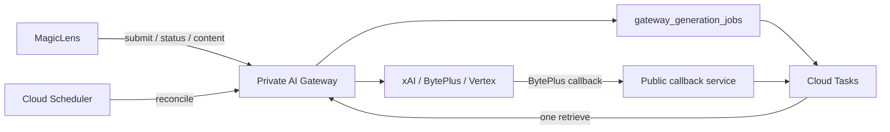

# ADR-001: Durable asynchronous AI generation jobs

## Status

Accepted — 2026-07-09

## Context

Video providers return a request identifier and finish rendering asynchronously. xAI and
Vertex/Veo require status retrieval; BytePlus supports a callback but still recommends
retrieval as the recovery path. The existing gateway and MagicLens clients poll within a
single request or worker invocation for as long as 20 minutes. That ties render duration to
HTTP and worker lifetimes, delays transient-failure detection, and can lose a paid provider
request identifier when a caller disconnects.

The provider render itself cannot be made materially faster. The system can make submission,
status propagation, recovery, and failure handling faster and more reliable.

## Decision

The AI Gateway owns durable long-running generation jobs.

- `POST /v1/generation-jobs` durably binds an authenticated owner and idempotency key to one
  request hash, then submits exactly once and records the provider request identifier.
- `GET /v1/generation-jobs/{id}` exposes a provider-neutral state machine.
- `GET /v1/generation-jobs/{id}/content` is authenticated and streams provider content behind
  a stable gateway URL.
- Provider adapters implement separate `submit`, `retrieve`, and `content` operations.
- Cloud Tasks invokes one status retrieval at a time using 5, 10, and 20 second delays with
  jitter. Cloud Scheduler reconciles due work every minute.
- BytePlus callbacks only record the callback and enqueue a private provider verification.
  Polling remains the recovery path.
- Terminal transitions and spend attribution use database compare-and-set/row-lock guards.
- Jobs expire after two hours, after one final provider check. Terminal rows are retained for
  30 days.
- Legacy blocking video endpoints remain available during migration and emit structured
  deprecation telemetry. An async failure is never retried through a legacy submit route.

The main gateway remains private. A separate public callback-only service exposes no model or
content APIs and validates a random per-job token.

## Component responsibilities

## Alternatives considered

### Gateway-owned jobs (chosen)

Pros:

- Provider credentials, IDs, retry semantics, costs, and temporary URLs have one owner.
- All consumers get the same API and state machine.
- A consumer restart cannot resubmit a paid generation when the provider ID is durable.

Cons:

- Adds gateway persistence, task infrastructure, and an authenticated content proxy.
- Requires a staged migration while legacy endpoints remain operational.

### MagicLens-owned jobs

Pros:

- Reuses MagicLens run persistence and continuation queues.
- Makes the initial gateway change smaller.

Cons:

- Duplicates provider-specific polling, callbacks, cost rules, and credentials across clients.
- Prevents the gateway from being the authoritative boundary for all AI calls.

### Minimal patch to existing polling

Pros:

- Lowest short-term implementation cost.
- No new public interface.

Cons:

- Keeps long HTTP/worker lifetimes and orphan risk.
- Does not give callbacks and polls a durable race-safe state machine.
- Does not solve provider-specific client logic or temporary content handling.

## Consequences

Submission latency is separated from render latency, worker capacity is released while a
provider is pending, and provider failures normally become visible within 30 seconds. The
system accepts eventual status consistency and additional operational components. The old
1,800-second Cloud Run timeout remains only during migration; after 30 consecutive days with
zero legacy video events it can be reduced to 120 seconds and the legacy polling paths removed.

## Security and operations

- Prompts, media bytes, provider credentials, and raw client keys are not persisted in the job
  table.
- Callback payloads and uploads have size limits. Callback tokens and temporary URLs disappear
  with retention cleanup.
- Cloud Tasks and Scheduler use OIDC to invoke the private gateway.
- Operators must reconcile `SUBMISSION_OUTCOME_UNKNOWN` jobs; automation must not resubmit them.
- The xAI key formerly available to MagicLens must be rotated during cutover and removed from
  MagicLens runtime environments.

